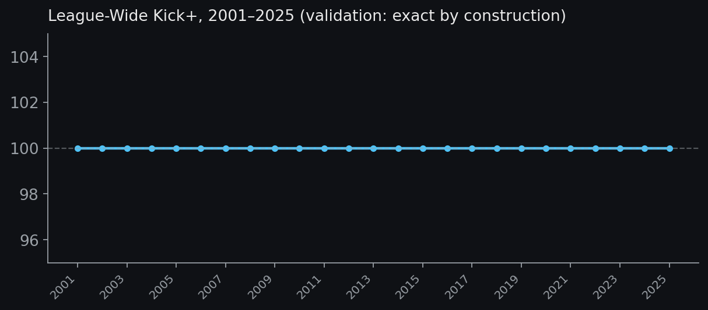
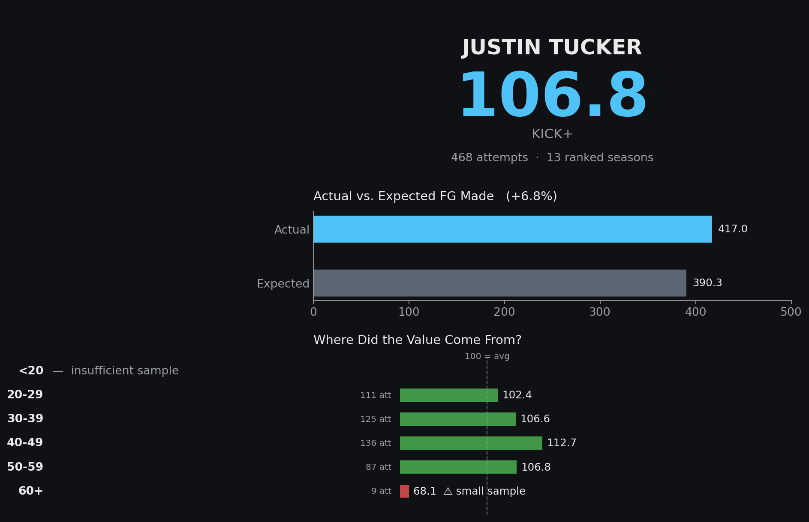
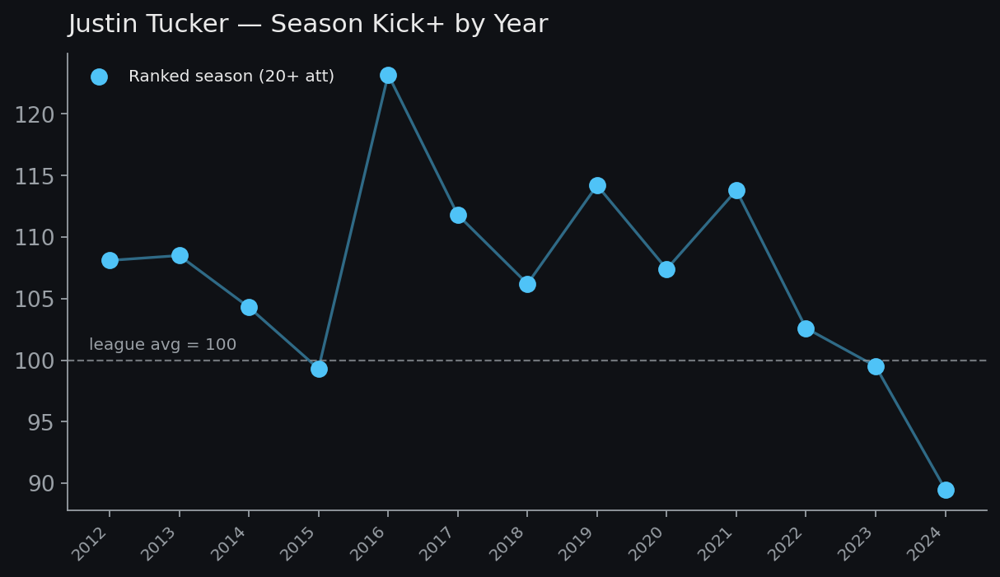
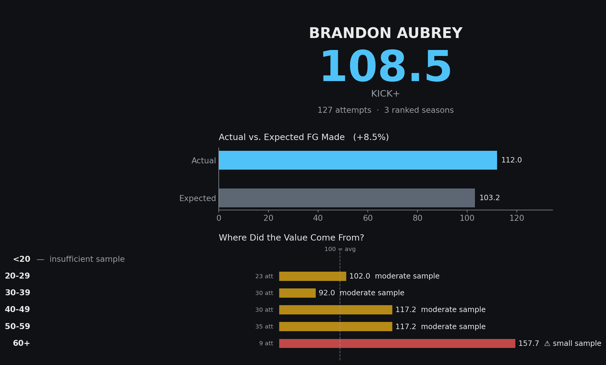
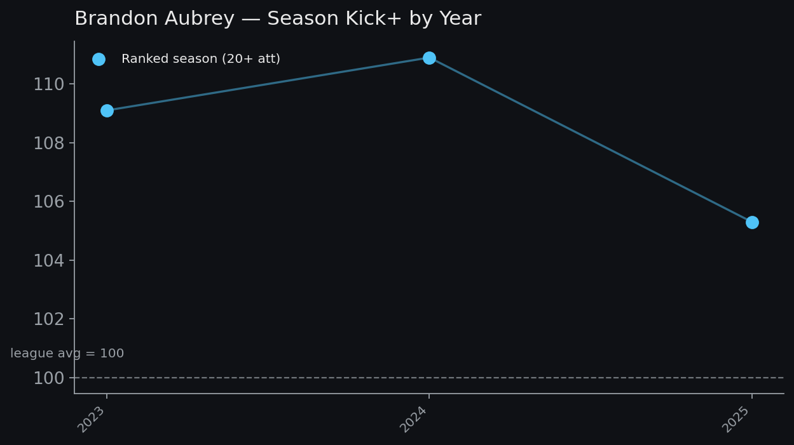

# Kick+ — An Era- and Distance-Adjusted NFL Kicking Statistic

**Status: V1 frozen.** The formula, thresholds, and tiering rules below are locked.
Everything past this point is UI/visualization work, not statistic design.

## Definition

```
Kick+ = 100 x (Sum of FG Made) / Sum(Attempts x League FG% for that distance-bucket/year)
```

**Plain-language:** Kick+ measures how many field goals a kicker made relative to
how many an *average* NFL kicker would be expected to make, given the exact same
distribution of attempts — same distances, same years/eras.

- **100** = league average
- **110** = made 10% more field goals than an average kicker would have, on the same attempts
- **90** = made 10% fewer

Note the formula does *not* need to reference the 3-point value of a field goal —
it cancels out, since every make is worth the same. Kick+ is a **makes-relative-to-expectation**
stat, not a points-value stat. That's a deliberate scope decision: it answers "how good was this
kicker relative to what he was asked to attempt," not "how many points did his leg add to his team."

## Data sources

Both derived from `21st_Century_NFL_Field_Goal_Kicking_Performance.xlsx`:

- **Kicker-season-bucket data** — `Cleaned and Reformatted` sheet (makes/attempts per
  distance bucket, per kicker, per season)
- **League baseline rate** — `Yearly Aggregates` sheet, **recomputed from raw made/attempt
  totals** rather than using the sheet's precomputed rate column, which contains `#DIV/0!`
  strings for zero-attempt buckets in some years. Trusting that column directly would have
  silently corrupted results with no error thrown.

Distance buckets: `<20`, `20-29`, `30-39`, `40-49`, `50-59`, `60+`.

## Validation

Two checks were run against every one of the 25 seasons (2001–2025) in the dataset:

1. **Internal consistency** — because the baseline *is* the league rate for that
   bucket/year, summing Kick+ across the entire league in any given year must equal
   exactly 100.00. It does, every year, with zero deviation.
2. **Cross-sheet integrity** — total attempts reconstructed by summing every kicker's
   season rows must match the `Yearly Aggregates` sheet's reported total attempts.
   It matches exactly, every year, down to the attempt.



*If every kicker in a season were evaluated together, the league baseline is exactly 100 — by
construction, not by luck. This is the sanity-check chart for the paper.*

## Sample-size thresholds

The threshold governs **leaderboard eligibility only.** It never alters the underlying
Kick+ number — a player's own profile page always shows their real number, tagged with
however much (or little) evidence sits behind it.

| Leaderboard construct | Minimum attempts to be *ranked* |
|---|---:|
| Career Kick+ | 100 |
| Season Kick+ | 20 |
| Distance bucket: `<20` | 20 |
| Distance bucket: `20-29` | 20 |
| Distance bucket: `30-39` | 20 |
| Distance bucket: `40-49` | 20 |
| Distance bucket: `50-59` | 15 |
| Distance bucket: `60+` | 5 |
| Consistency (SD) | 3 qualifying (20+ att) seasons |

**Season tiers** (shown on player pages, not just leaderboards):
- **20+ attempts** → ranked
- **10–19** → shown, marked small sample
- **<10** → not ranked

**Distance-bucket cell tiers** (independent of the leaderboard minimums above):
- 🟢 **40+ attempts** → normal confidence
- 🟡 **10–39** → moderate sample
- 🔴 **5–9** → small sample, shown with a warning
- **<5** → not displayed at all ("insufficient sample," no number shown)

## Consistency is a separate stat, not a blended one

**Kick+ asks:** how good were you?
**Consistency asks:** how much did your performance vary?

`Consistency SD` = standard deviation of a kicker's season Kick+ values, using only
their ranked (20+ attempt) seasons, and only computed for kickers with 3+ such seasons.
Lower SD = more consistent. This is deliberately **not combined into Kick+** — doing so
would require an arbitrary weighting decision between "how good" and "how stable," and
would make the headline number harder to explain.

Findings that justify keeping them separate:

- **Tyler Bass** and **Lawrence Tynes** are the most consistent kickers in the dataset
  (SD ≈ 2.0), despite being roughly average by Kick+ (97–98). Consistency and ability
  are answering genuinely different questions.
- **Sebastian Janikowski** and **Chris Boswell** — long, above-average careers (103+ Kick+
  over 11–17 ranked seasons) — both carry SD over 10. Even strong veterans wobble
  year to year.
- Only 86 of 185 career kickers in the dataset clear the 3-ranked-season bar. The
  rest show a blank consistency field, not a zero or an estimate — blank is more honest
  than a misleadingly precise number from one or two seasons.

## The centerpiece visualization: player pages

Two contrasting profiles make the case for showing sample size front and center.

### Justin Tucker — deep sample, long career



Every bucket except 60+ sits in the green (40+ attempts). The 60+ number — 68.1 — is
real, but it's 9 attempts. Flagging it in red instead of quietly reporting it prevents
the wrong story ("Tucker is bad at 60-yarders") from being read into a number that's
really "Tucker has rarely been asked to try one."



### Brandon Aubrey — short career, extreme distance profile



Aubrey's whole profile sits in yellow (moderate sample) except one red flag — but the
shape of the profile is the story: he gets *better* as distance increases, capping at
157.7 from 60+. That's the signature of a specialist, and it shows up in the data
without needing a clustering model to find it.



## Career leaderboard (top 10, min. 100 attempts)

| Rank | Player | Attempts | Seasons | Kick+ |
|---:|---|---:|---:|---:|
| 1 | Cameron Dicker | 138 | 4 | 108.6 |
| 2 | Brandon Aubrey | 127 | 3 | 108.5 |
| 3 | Justin Tucker | 468 | 13 | 106.8 |
| 4 | Jason Hanson | 330 | 12 | 106.5 |
| 5 | Mike Vanderjagt | 170 | 6 | 106.0 |
| 6 | John Kasay | 303 | 11 | 105.1 |
| 7 | Joe Nedney | 209 | 9 | 104.6 |
| 8 | Josh Lambo | 147 | 7 | 104.4 |
| 9 | Matt Stover | 269 | 9 | 104.4 |
| 10 | Eddy Pineiro | 155 | 6 | 104.3 |

Full leaderboards live in `leaderboard_career.csv`, `leaderboard_best_season.csv`,
`leaderboard_most_consistent.csv`, and one `leaderboard_<bucket>.csv` per distance bucket.

## What's explicitly NOT in V1

Weather adjustment, altitude, play-by-play/leverage data, kicker archetype clustering,
any ML, and any single composite "Kicker Score" that blends Kick+ with consistency or
anything else. Kick+ stays a clean, explainable, single-purpose number. Those become
separate modules later (`KickerLab`), not features bolted onto Kick+ itself.

## Files

| File | Contents |
|---|---|
| `kick_plus_engine.py` | Calculation engine + validation suite (run this first) |
| `make_visuals.py` | Generates every PNG in this README |
| `career_kick_plus.csv` | Every kicker: career Kick+, attempts, seasons, consistency SD |
| `season_kick_plus.csv` | Every kicker-season: Kick+, attempts, tier |
| `kick_plus_distance_profile.csv` | Wide table: Kick+ + attempts + sample tag per bucket per kicker |
| `career_kick_plus_by_bucket.csv` | Long-format version of the same |
| `leaderboard_career.csv` | Career leaderboard (100+ att) |
| `leaderboard_best_season.csv` | Best individual seasons (20+ att) |
| `leaderboard_most_consistent.csv` | Lowest consistency SD (3+ ranked seasons) |
| `leaderboard_<bucket>.csv` | Per-distance-bucket leaderboards, tier-specific minimums |
